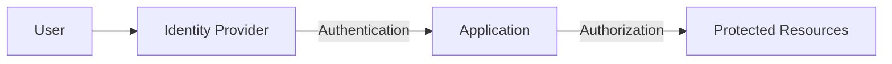

# Identity Management Overview

Modern users expect a **frictionless, well-designed experience** when accessing applications. Identity management should enable quick, secure access—not act as a barrier.  

This repository introduces the **concepts, challenges, and protocols** developers must consider when designing identity management for modern applications.

---

## Purpose

This guide helps new team members:  

- Understand the **key challenges** of identity management.  
- Recognize the **trade-offs** between security, user experience, and platform constraints.  
- Learn the **protocols and workflows** that underpin authentication and authorization.  

---

## Key Points

- Identity management is a **complex, multi-dimensional problem**.  
- Solutions must be tailored to the **sensitivity, user experience, and delivery platforms** of the application.  
- This repository provides an **overview and starting point**, not a comprehensive reference.  
- Covered topics include:  
  1. Common requirements for identity management in modern applications.  
  2. Three widely used protocols—what they are, how they work, and how to make a basic request.  
  3. The **“life of an identity”**—events and interactions that define the user journey.  

---

## Visual Overview

The diagram below illustrates the core identity flow:  

- Users authenticate with an **identity provider**.  
- Applications request and validate identity.  
- Authorized access is granted to protected resources.  

---

## Next Steps

1. Review the **overview of identity management**.  
2. Explore the **protocols section** (OAuth 2.0, OpenID Connect, SAML).  
3. Walk through the **example requests** to see authentication and authorization in action.  
4. Join team discussions to evaluate **trade-offs** as we design solutions for our applications.  