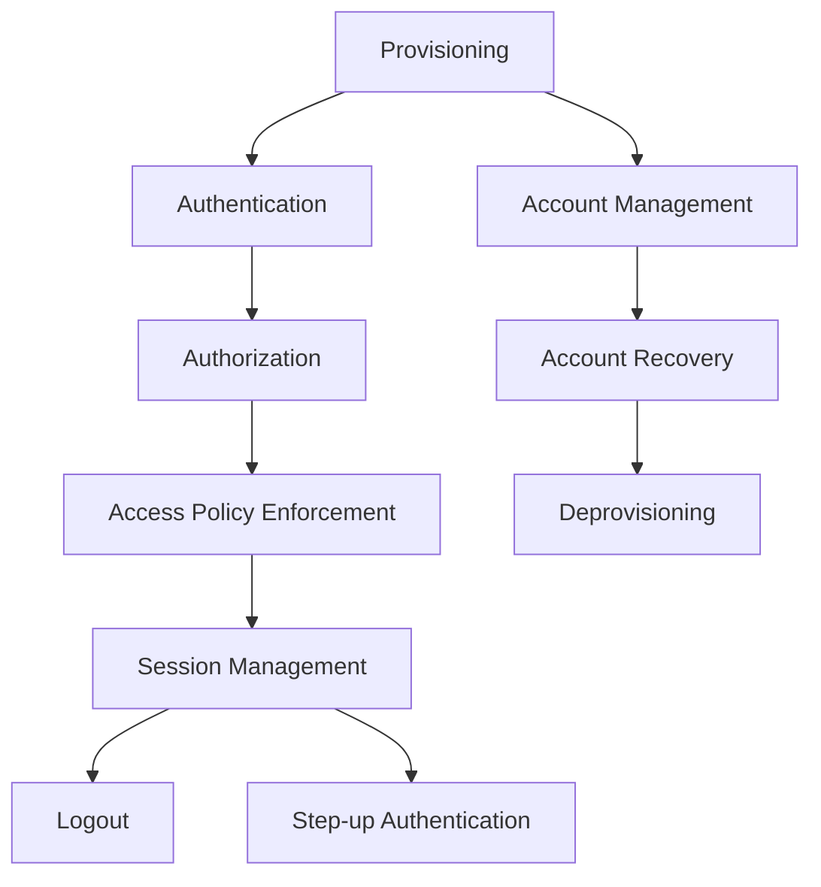

The Life of an Identity
===

This repository introduces the core concepts of accounts, identities, and the events that occur throughout their lifecycle. It serves as a foundation for understanding how modern applications handle identity management, from account creation to eventual deprovisioning.

# Purpose

This guide helps new team members:

Learn the relationship between identities, accounts, and sessions.

Understand the key lifecycle events of an identity.

Explore essential concepts like provisioning, authentication, and authorization that form the basis of secure access control.

# Key Points

Provisioning – Creates an account and associated identity.

Authentication – Validates that a user is entitled to use an account.

Authorization – Specifies the privileges granted for an account.

Access Policy Enforcement – Ensures requests stay within authorized privileges.

Session Management – Governs how long a user can remain active without reauthenticating.

Single Sign-On (SSO) – Lets users log in once and access multiple protected resources.

Multi-Factor Authentication (MFA) – Requires multiple credential types (knowledge, possession, inherence).

Step-Up Authentication – Elevates an existing session to a higher assurance level with stronger credentials.

Logout – Terminates a session, requiring reauthentication for further access.

Account Management – Enables users or admins to update identity attributes.

Account Recovery – Restores access if authentication credentials are lost.

Deprovisioning – Removes or disables an account and its associated identity.

