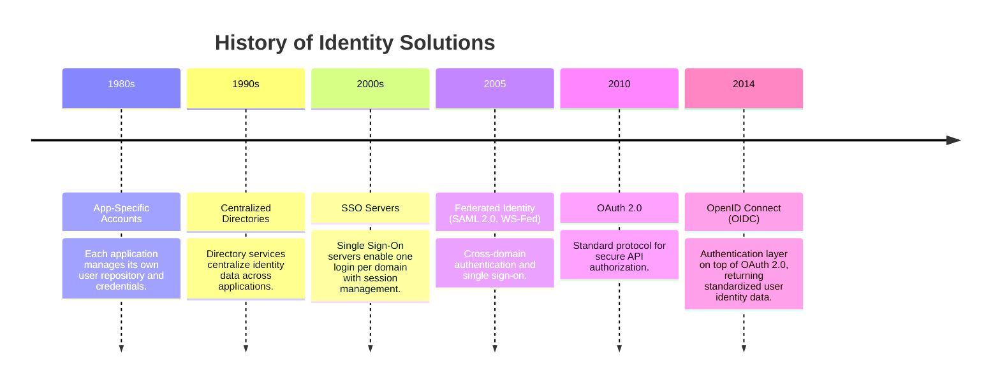

Evolution of Identity Management

Identity management has undergone significant changes over time, evolving from simple application-specific solutions to
standardized protocols that support secure, seamless access across applications and domains. Understanding this
progression helps us evaluate the trade-offs of past designs and apply modern solutions effectively.

Purpose

This guide helps new team members:

Recognize how identity management approaches have evolved.

Understand the limitations of earlier models and why newer standards emerged.

Gain context for modern protocols (SAML, OAuth 2.0, OpenID Connect) that we use today.

Key Points

Application-Specific Identities – Early systems required separate credentials for each application.

Centralized Directories – Enabled single identity/credential across apps, but users still logged in separately.

Single Sign-On (SSO) – Allowed users to log in once per domain and access multiple applications via session management.

Federated Identity – Protocols like SAML 2.0 and WS-Fed enabled cross-domain SSO.

OAuth 2.0 – Designed for authorizing applications to call APIs on behalf of a user.

OpenID Connect (OIDC) – Extends OAuth 2.0 to provide authentication and standardized user information.

