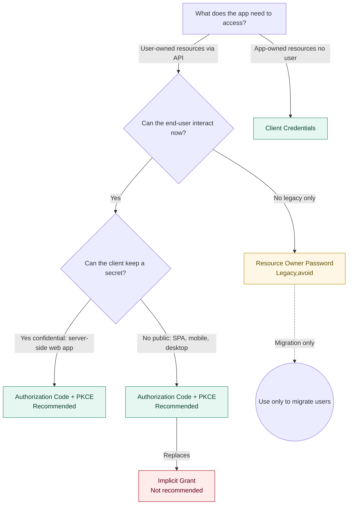

OAuth 2.0 Overview
===

Modern applications often rely on APIs to access data or services. Because APIs frequently protect valuable resources, they require authorization to ensure only approved applications or users can call them.

The OAuth 2.0 protocol provides a secure way for applications to obtain authorization—either on behalf of a user or on their own—without requiring users to share their credentials directly with the application.

This gives users more control over what applications can access, how long that access lasts, and the ability to revoke access for one application without affecting others.

# Key Concepts

## Access Tokens
Temporary credentials issued to an application to call an API.

## Scopes
Define the level of access (e.g., read-only vs. full access) granted to the application.

## Authorization vs. Authentication
OAuth 2.0 focuses on authorization (granting access to resources). Authentication (verifying a user’s identity) is covered separately, often using OIDC.

# OAuth 2.0 Grant Types

OAuth 2.0 defines several ways (called grant types) for an application to obtain access tokens:

1. Authorization Code Grant (with PKCE)

* Recommended for web, mobile, and native apps.

* Secure and flexible.

2. Implicit Grant

* Not recommended — exposes tokens in URLs and increases risk of compromise.

3. Resource Owner Password Grant

* Only for legacy migration cases.

* Exposes user credentials to the application.

3. Client Credentials Grant

* Used when the application itself owns the resource.

* No end-user involved.

# Refresh Tokens

Used to obtain new access tokens without requiring the user to reauthorize.

Extends session duration while keeping access tokens short-lived for security.

# Why It Matters

Users no longer need to share passwords with applications.

Applications only receive limited, scoped access to APIs.

Users can revoke access at any time without disrupting other integrations.