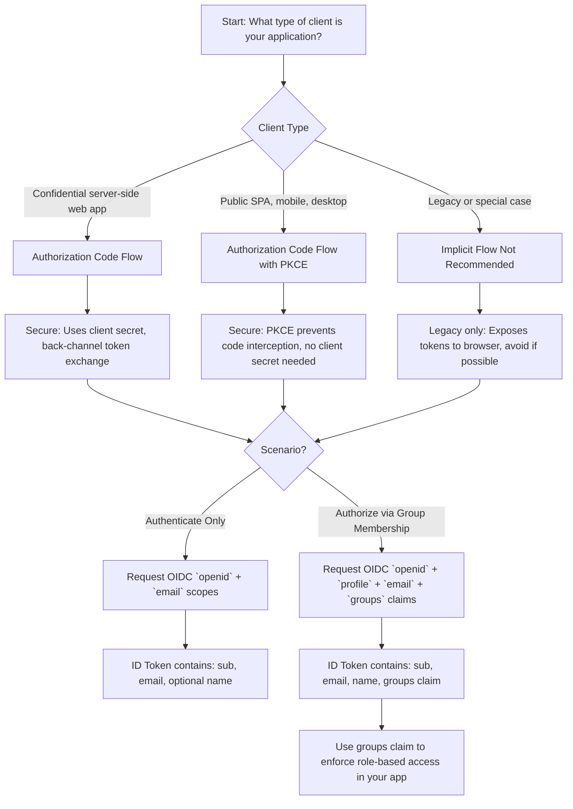

# OpenID Connect (OIDC) Overview

OpenID Connect (OIDC) is an **identity layer built on top of OAuth 2.0**.  

It allows applications to **authenticate users** and enables **single sign-on (SSO)** across multiple applications 
while also supporting OAuth 2.0-based API authorization.

---

## How OIDC Enhances OAuth 2.0

OIDC adds:

1. **ID Token**  
   - A security token containing claims about the **authentication event** and the **authenticated user**.  

2. **UserInfo Endpoint**  
   - Provides additional standardized or custom claims about the user.  

Using OIDC together with OAuth 2.0 allows applications to:

- Delegate authentication to a trusted **OpenID Provider (IdP)**.
- Authenticate users securely without managing credentials directly.
- Obtain user information in a **consistent, standardized format**.
- Implement single sign-on across applications.

---

## Key Concepts & Best Practices

- OIDC supports **three flows** to suit different client profiles
  - Authorization Code Flow
  - Implicit Flow
  - Hybrid Flow
- Authorization codes and security tokens can be returned via **front-channel** or **back-channel** responses.  
  - **Back-channel** responses are preferred to avoid exposing sensitive information in the browser.  
  - Access tokens or refresh tokens should **not be returned via front-channel**.  
- Sensitive information in ID Tokens should be **encrypted or retrieved via the UserInfo endpoint** if front-channel responses are unavoidable.  
- OIDC defines **standard claims** (like `sub`, `name`, `email`) and allows **custom claims** for additional application-specific data.

---

## Key Points

- OIDC provides an **identity layer** on top of OAuth 2.0 for authentication.  
- Enables **single sign-on (SSO)** across applications.  
- Adds **ID Tokens** and a **UserInfo endpoint** to obtain user profile info.  
- Supports both **standard** and **custom claims**.  
- Defines **multiple grant flows** and **response modes** to meet security requirements.  
- Sensitive information should be handled via **back-channel responses** or encrypted ID Tokens.

---