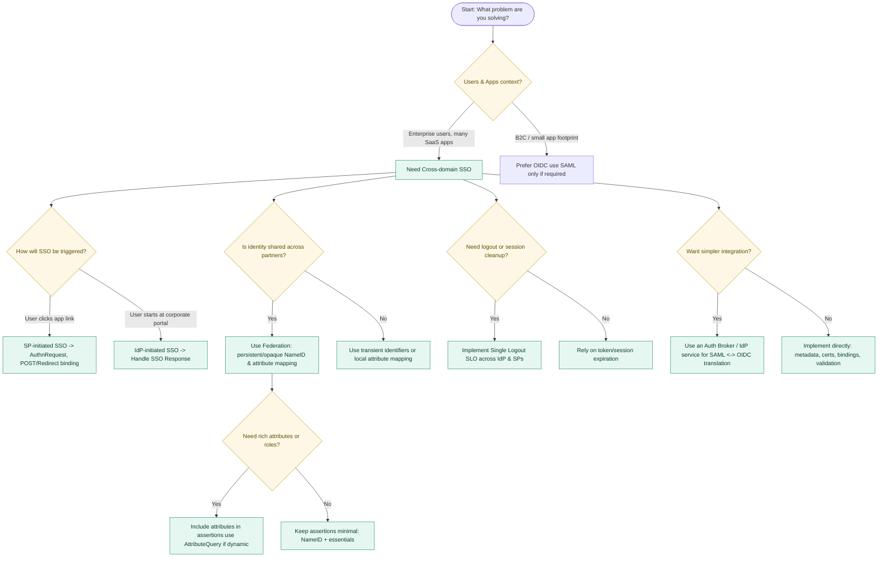

# SAML 2.0 Overview

This document provides a concise introduction to **SAML 2.0 (Security Assertion Markup Language)**—its role in authentication and identity federation, why it became widely adopted, and how it compares to modern alternatives like **OIDC** and **OAuth 2.0**.

---

## What is SAML 2.0?

- **Definition**: An XML-based framework for exchanging security information between business partners.  
- **Primary Use Case**: Web-based **single sign-on (SSO)** across domains.  
- **Adoption**: Widely implemented in enterprises for cloud and SaaS applications.  

---

## Key Features

### Cross-Domain Single Sign-On (SSO)
- Users authenticate once with a central **Identity Provider (IdP)**.
- They can then access multiple applications (**Service Providers, SPs**) without re-entering credentials.

### Identity Federation
- Establishes a **common identifier** for a user between IdPs and SPs.
- Can use a shared identifier (e.g., email) or an opaque internal identifier.

### Security Improvements
- Eliminates the need for apps to handle or store static passwords.  
- Applications receive **assertions**, not credentials.  

---

## How It Works (High-Level)

1. User tries to access a protected app **Service Provider** (SP).  
2. SP redirects the user to the **Identity Provider** (IdP) for authentication.  
3. IdP authenticates the user (e.g., password, MFA).  
4. IdP sends an **Authentication Response** back to the SP which contains an **Assertion** with claims about the user.  
5. SP validates the assertion and grants access.  

---

## Modern Context

- **SAML** is proven but older compared to **OIDC (OpenID Connect)** and **OAuth 2.0**  
- **Modern apps** (API-driven) benefit more from **OIDC + OAuth 2.0**.
- **Best practice today**:  
  Use an **identity platform** that supports both modern and legacy protocols.  
  This allows apps to be built with OIDC/OAuth while still supporting customers who require **SAML or Web Services Federation Language (WS-Fed)**.  

---

## Key Points (Quick Recap)

- SAML reduces exposure of credentials, centralizes identity management.  
- SAML enables **web SSO** and **identity federation**.
- Still relevant for enterprises, but modern apps should prefer **OIDC + OAuth 2.0**.
- IdP authenticates users; SP validates **assertions**.  
- Authentication response XML contains claims about the user.  

---

## Choosing the Right SAML Features

# Why is SAML so complex?

1. Historical Context

    - Early 2000s design: SAML 1.0 (2002) predates REST/JSON; XML was the standard.
    - SAML is focused on completeness over simplicity.

2. Protocol Stack Complexity

    - XML Signatures & Encryption are Hard to implement and Hard to debug.

    - Multiple Bindings: POST, Redirect, Artifact, SOAP and more options means more complexity.

    - Metadata & Certificates: Large XML trust files requires certificate rotation overhead.

3. Verbose Data Model

    - Assertions can contain authN statements, attributes, authZ decisions.

    - Federation features add more complexity (persistent vs transient IDs, attribute queries).

4. Interoperability Challenges

    - Different IdPs (Okta, ADFS, Shibboleth, Ping) have subtle quirks.

    - Backward compatibility with older IdPs adds friction.

5. contrasting with OIDC by Analogy
    * SAML: Like COBOL it is verbose, old, enterprise-focused, Swiss Army knife, Covers every use case, at the cost of complexity.
    * OIDC: Like Go it is modern, lightweight, JSON, REST-based, easier to debug.
